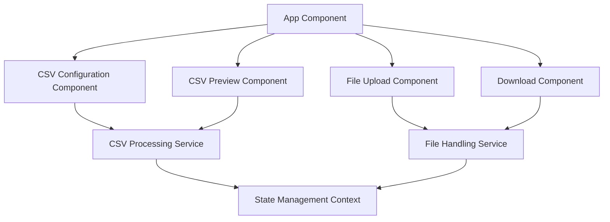

# Design Document: CSV Processor

## Overview

The CSV Processor is a client-side React application that allows users to upload CSV files, configure how the data should be interpreted, perform transformations on financial data, and download the processed file with standardized columns. The application runs entirely in the browser with no backend dependencies, making it portable and easy to deploy.

## Architecture

The application follows a component-based architecture using React functional components with hooks for state management. The architecture consists of the following layers:

1. **UI Components**: Responsible for rendering the interface and capturing user interactions
2. **State Management**: Using React's Context API and hooks to manage application state
3. **CSV Processing Logic**: Utilities for parsing, transforming, and generating CSV data
4. **File Handling**: Services for file upload and download operations



## Components and Interfaces

### App Component

The main container component that orchestrates the application flow and maintains the overall UI structure.

**Props**: None
**State**: Current step in the workflow

### FileUpload Component

Handles drag-and-drop file uploads and initial CSV parsing.

**Props**:

- `onFileLoaded`: Callback function when file is successfully loaded
- `onError`: Callback function when an error occurs

**State**:

- `isDragging`: Boolean indicating if a file is being dragged over the drop zone
- `error`: Error message if file upload fails

### CSVConfiguration Component

Provides interfaces for configuring how the CSV data should be interpreted.

**Props**:

- `csvData`: Raw CSV data
- `onConfigurationComplete`: Callback function when configuration is complete

**State**:

- `headerRowIndex`: Index of the selected header row
- `columnMappings`: Object mapping column names to data types
- `dateColumn`: Selected date column
- `dateFormat`: Detected or selected date format
- `invertAmounts`: Boolean indicating if amounts should be inverted

### CSVPreview Component

Displays a preview of the CSV data with applied transformations.

**Props**:

- `csvData`: Raw CSV data
- `configuration`: Configuration object with header row, column mappings, etc.

**State**:

- `processedData`: Transformed data based on current configuration
- `currentPage`: Current page in the paginated view

### DownloadComponent

Handles the generation and download of the processed CSV file.

**Props**:

- `csvData`: Raw CSV data
- `configuration`: Configuration object with header row, column mappings, etc.
- `onDownloadComplete`: Callback function when download is complete

**State**:

- `isGenerating`: Boolean indicating if file generation is in progress

## Data Models

### CSVData

Represents the raw CSV data loaded from a file.

```typescript
interface CSVData {
  rawText: string;
  rows: string[][];
}
```

### Configuration

Represents the user's configuration for processing the CSV data.

```typescript
interface Configuration {
  headerRowIndex: number;
  columnMappings: {
    date?: string;
    amount?: string;
    amountType?: string;
    income?: string;
    expense?: string;
    description?: string;
    reference?: string;
  };
  dateFormat: "DD/MM" | "MM/DD" | "auto";
  invertAmounts: boolean;
}
```

### ProcessedRow

Represents a row of processed CSV data.

```typescript
interface ProcessedRow {
  [key: string]: string | number;
  US_DATE?: string;
  UK_DATE?: string;
  ISO_DATE?: string;
  CLEAN_AMOUNT?: number;
}
```

## CSV Processing Logic

### Date Format Detection

The system will detect the date format by examining the values in the selected date column:

1. Parse each value in the date column
2. Check if any day value exceeds 12
3. If found, assume DD/MM format; otherwise, default to MM/DD
4. Allow user override of the detected format

### Amount Calculation Logic

The system will calculate the CLEAN_AMOUNT based on the column mappings:

1. If income and expense columns are selected:
   - CLEAN_AMOUNT = income - expense
2. If amount and amount type columns are selected:
   - CLEAN_AMOUNT = amount
   - If amount type contains 'D', multiply CLEAN_AMOUNT by -1
3. If "Invert Amounts" is checked:
   - Multiply CLEAN_AMOUNT by -1

### Date Standardization

The system will generate three standardized date formats:

1. US_DATE: MM/DD/YYYY
2. UK_DATE: DD/MM/YYYY
3. ISO_DATE: YYYY-MM-DD

## Error Handling

The application will implement comprehensive error handling:

1. **File Upload Errors**:

   - Invalid file type
   - File too large
   - File parsing errors

2. **Data Validation Errors**:

   - Invalid date formats
   - Non-numeric values in amount columns
   - Missing required columns

3. **Processing Errors**:
   - Transformation failures
   - Download generation errors

Each error will be displayed with a clear message and, where applicable, suggestions for resolution.

## Testing Strategy

### Unit Tests

- Test CSV parsing functions
- Test date format detection logic
- Test amount calculation logic
- Test date standardization functions

### Component Tests

- Test FileUpload component with valid and invalid files
- Test CSVConfiguration component with various configuration scenarios
- Test CSVPreview component with different data sets
- Test DownloadComponent functionality

### Integration Tests

- Test the complete workflow from file upload to download
- Test error handling across components
- Test state management across the application

### User Acceptance Testing

- Test with various CSV formats and data structures
- Test with edge cases (empty files, large files, etc.)
- Test across different browsers and devices

## Performance Considerations

1. **Large File Handling**:

   - Implement pagination for displaying large CSV files
   - Use web workers for processing large datasets without blocking the UI
   - Implement virtual scrolling for efficient rendering of large tables

2. **Memory Management**:

   - Optimize data structures to minimize memory usage
   - Clean up resources when components unmount

3. **Responsive Design**:
   - Ensure the application is usable on various screen sizes
   - Optimize UI components for mobile devices

## Security Considerations

1. **Data Privacy**:

   - All processing occurs client-side; no data is sent to servers
   - No data persistence beyond the current session unless explicitly downloaded

2. **File Handling**:
   - Validate file types and content before processing
   - Implement size limits to prevent browser crashes

## Accessibility

1. **Keyboard Navigation**:

   - Ensure all interactive elements are keyboard accessible
   - Implement proper tab order

2. **Screen Reader Support**:

   - Add ARIA attributes to enhance screen reader compatibility
   - Provide text alternatives for visual elements

3. **Color Contrast**:
   - Ensure sufficient contrast for text and interactive elements
   - Provide visual cues beyond color for state changes
